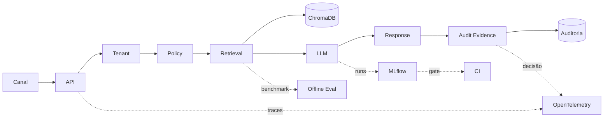

# Chat Pref

### Plataforma de Atendimento Institucional: IA, RAG e Arquitetura Tenant-Aware


O **Chat Pref** é uma base de engenharia projetada para demonstrar, de forma rastreável e auditável, como implantar fluxos de LLM aplicados (GenAI) em ambientes governamentais e institucionais, nos quais **latência**, **isolamento de dados** e **segurança de marca** não são opcionais.

⚠️ **Para fins de avaliação de arquitetura ou bancas técnicas, visite a home de Portfólio:**
👉 [Acessar Estudo de Caso Principal](docs-fundacao-operacional/estudo_de_caso.md)

---

## 🏛 Principais Capacidades da Arquitetura

O foco deste repositório não é um front-end comercial, mas a solidez do **Backend GenAI** e sua **Fundação Operacional**:

- **Isolamento Tenant-Aware por Design:** O `tenant_id` é o guardrail absoluto. Nenhum documento se mistura na Collection Vetorial (ChromaDB) e nenhuma requisição segue no pipe sem seu contexto explícito.
- **RAG Limpo e Boilerplate-Free:** Em vez de frameworks mágicos (`Langchain`/`LlamaIndex`), as injeções de embeddings são escritas proceduralmente em roteadores assíncronos do FastAPI, garantindo extrema baixa latência e observabilidade contínua.
- **Políticas Restritivas (Guardrails):** Fluxos de validação de query (`policy_pre`) e resposta (`policy_post`) que abortam a emissão e disparam *fallbacks* determinísticos antes mesmo de onerar provedores comerciais.
- **Observabilidade Estrutural:** Telemetria centralizada em `X-Request-ID`. Métricas via OpenTelemetry integradas em logs JSONL auditáveis.
- **Dual Pipeline (Síncrono vs Experimentos):**
  - **Fluxo Síncrono:** Focado em tempo de resposta da API na AWS (Terraform/EC2/Docker).
  - **Fluxo Offline (LLMOps):** Focado em testes semânticos, drift e benchmark com MLflow executando pipelines separados.

> *Para uma leitura executiva aprofundada dos limites deste sistema, consulte nossa documentação de [Decisões e Trade-Offs](docs-fundacao-operacional/tradeoffs_decisoes.md) e [Matrizes de Capacidade](docs-fundacao-operacional/matriz_capacidades.md).*

---
## Fluxo end-to-end



O fluxo principal começa no canal de entrada e segue pela API, que resolve o tenant, aplica as políticas de segurança, recupera contexto no RAG e aciona o adaptador LLM para compor a resposta. A saída é devolvida com trilha de auditoria e evidência operacional da decisão. Em paralelo, benchmark offline, tracking experimental em MLflow, observabilidade e CI permanecem separados do runtime transacional para preservar governança, reprodutibilidade e clareza arquitetural.

---

## 🔍 Onde Estão as Evidências do Projeto

As evidências deste repositório não ficam condensadas num arquivo único, elas estão segmentadas por blocos funcionais para atestar cada face do ciclo de engenharia:

1. **[Evidência Operacional e de Runtime](app/audit/)**: Comprova que o fluxo transacional funciona. Inclui [auditoria por tenant](app/storage/audit_repository.py), `request_id`, *reason_codes*, e [traces/métricas OpenTelemetry](app/observability/). Mostra se a requisição sofreu fallback, bloqueio ou concluiu normalmente.
2. **[Avaliação Offline e Tracking (LLMOps)](docs-LLMOps/)**: Comprova que a IA é validada com base metodológica. Inclui [datasets controlados de baseline](benchmark_datasets/), script de [avaliação formal Ragas](scripts/run_phase4_rag_evaluation.py) e tracking estruturado de parâmetros no MLflow.
3. **[Documentação Técnica Consolidada](docs-fundacao-operacional/)**: Mostra que a base é clara e defensável. Abrange a [Arquitetura Ativa](docs-fundacao-operacional/arquitetura.md), o registro aberto de [Trade-offs](docs-fundacao-operacional/tradeoffs_decisoes.md), o [Estudo de Caso Principal](docs-fundacao-operacional/estudo_de_caso.md) e o [Roteiro de Demonstração (Walkthrough)](docs-fundacao-operacional/roteiro_demonstracao.md).
4. **[CI e Validadores de Automação](.github/workflows/)**: Comprova repetibilidade de governança. Possui [pipelines de regressão GenAI](scripts/evaluate_genai_ci_gate.py) agindo como *hard-fails* do repositório, dry-runs e automação de qualidade de código.
5. **[Este README](README.md)**: Opera como sua "Bússola de Navegação" global, servindo de ponto de salto para todo este corpo de trabalho, não substituindo as evidências, apenas indexando-as.

---

## 💻 Como Explorar (Execução Local / Lab)

O projeto requer um ambiente simples embasado em Docker para simular seu ambiente completo na sua máquina.

Para um ensaio rápido dos fluxos, disponibilizamos um **workshop guiado**:
👉 [Abrir Roteiro de Demonstração (Walkthrough Mínimo)](docs-fundacao-operacional/roteiro_demonstracao.md)

### Subindo a Base
Se apenas quiser visualizar o backend isolado operando local:
```bash
docker compose up -d --build
```
*A API será exposta em `http://localhost:8000`. Teste imediato em `/health`.*

---

## ⚙️ Stack Tecnológica Consolidada

- **Linguagem Principal:** Python 3.11+
- **API Mínima e Assíncrona:** FastAPI (Pydantic / Uvicorn)
- **Banco Vetorial:** ChromaDB embeddado (persistência em subpartições por tenant)
- **Tracing, Logging e Métricas:** OpenTelemetry (`X-Request-ID` injetado na sessão)
- **LLMs e IA:** Google Gemini (Opcional transacional) e Provedores Estocásticos Mockados (Usados ativamente em CI para economia de requests).
- **LLMOps (Offline):** MLflow local para armazenar artefatos de testes de regressão semântica.
- **Infra e Deploy:** Terraform na AWS (EC2/single-node), provisionado de forma segura e idempotente.
- **Integração Externa:** Webhook Https para Telegram (Demonstrativo).

---

## 📂 Organização da Documentação Executiva

O projeto divide historicamente as documentações pelos seus estágios de operação arquitetural:

* [Docs da Fundação Operacional](docs-fundacao-operacional/) - Onde a base funcional garantidora (`chat`, `webhook`, `guardrails`, `rag`) foi firmada e registrada.
* [Docs da Trilha de LLMOps](docs-LLMOps/) - Onde artefatos experimentais, avaliadores offline de drift semântico e pipelines com MLFlow são geridos sem impacto no servidor online.
